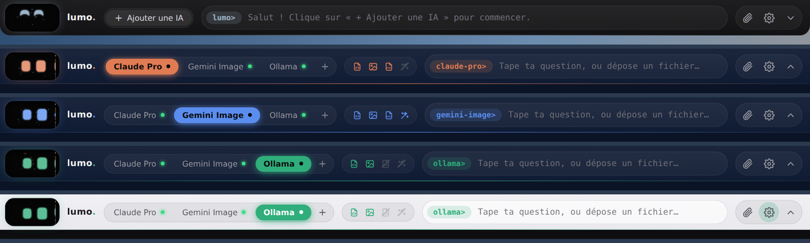
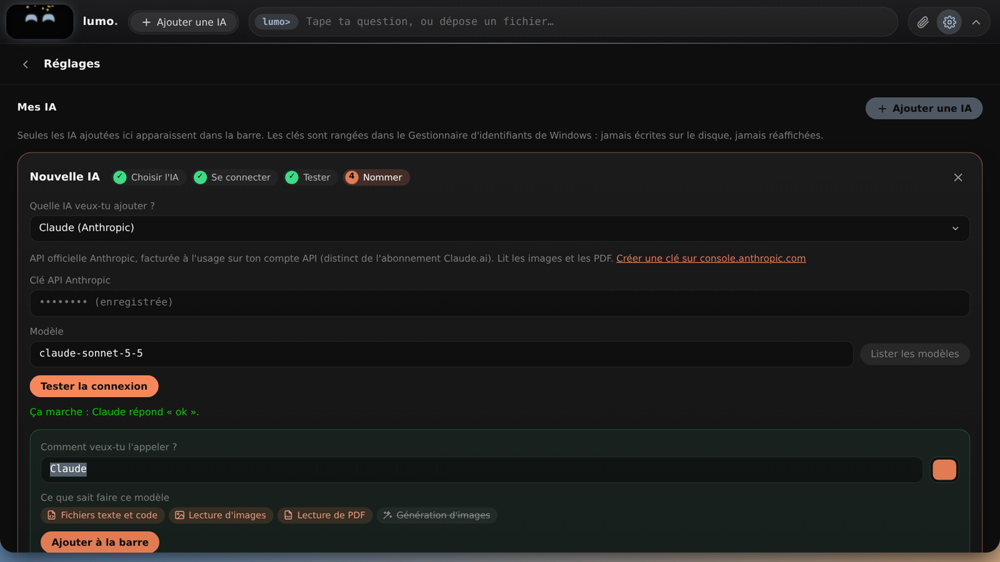
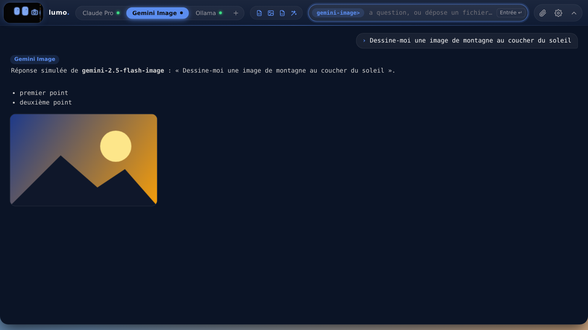
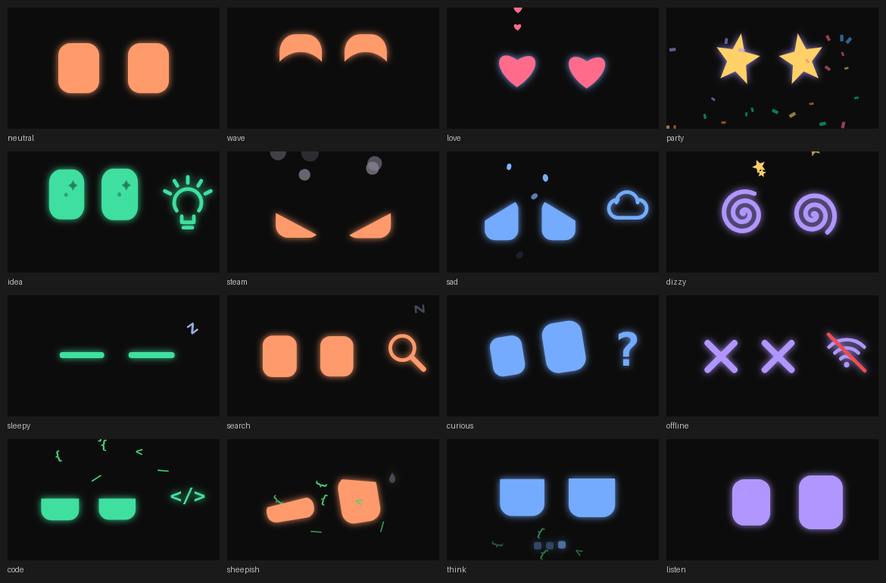
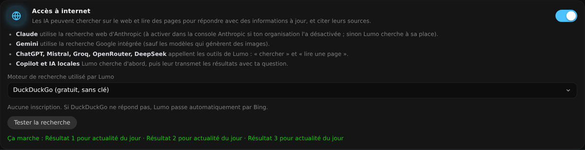
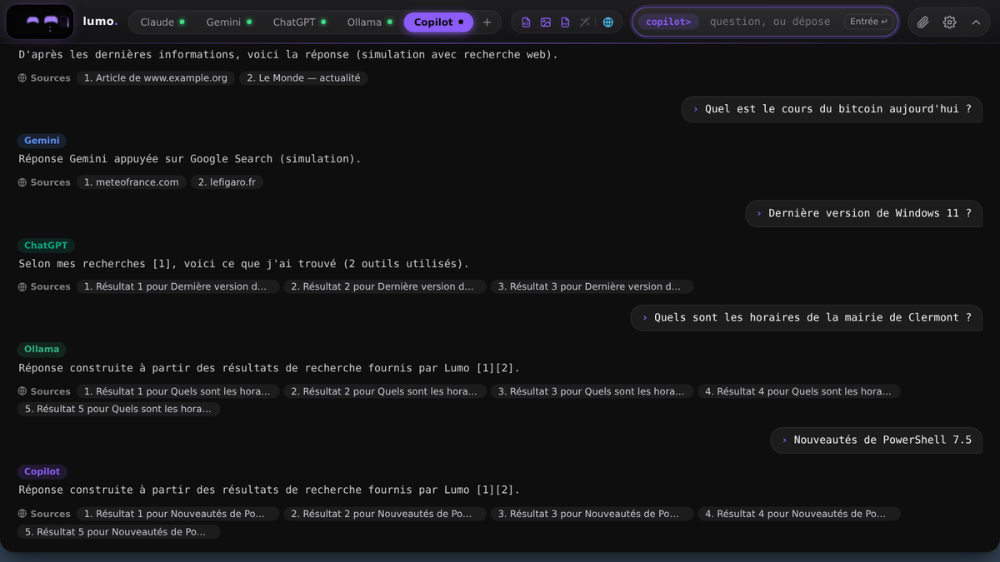
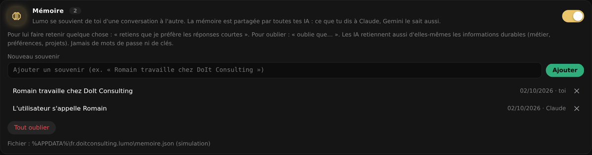

# Lumo — un compagnon de bureau pour Windows

**[⬇ Télécharger Lumo pour Windows (Lumo-Setup.exe)](https://github.com/PapaCanard/lumo/releases/latest/download/Lumo-Setup.exe)** · [toutes les versions](https://github.com/PapaCanard/lumo/releases)



## Installer en 3 clics

1. **Télécharge [Lumo-Setup.exe](https://github.com/PapaCanard/lumo/releases/latest/download/Lumo-Setup.exe)**.
2. **Double-clique dessus.** Si Windows affiche « Windows a protégé votre ordinateur », clique sur **Informations complémentaires** puis **Exécuter quand même** : l'installeur n'est pas signé numériquement (un certificat coûte plusieurs centaines d'euros par an), c'est normal.
3. **Lumo apparaît en haut de l'écran.** Clique sur **+ Ajouter une IA**, choisis ton IA, colle ta clé, teste, donne-lui un nom : c'est prêt.

Windows 10 ou 11, 64 bits. Pas besoin de droits administrateur, rien d'autre à installer (le composant WebView2 est inclus si ton PC ne l'a pas). Mises à jour : retélécharge et réinstalle par-dessus, tes IA et tes clés sont conservées. Désinstallation : Paramètres Windows → Applications → Lumo.


Deux yeux lumineux animés (façon petit robot de bureau) qui vivent dans une **barre collée en haut de ton écran** (comme la barre des tâches, mais en haut), te suivent du regard et transmettent tes questions aux IA **que tu as ajoutées** : Claude, Gemini, ChatGPT, Mistral, GitHub Copilot, OpenRouter, Groq, DeepSeek, Ollama, LM Studio ou toute API compatible OpenAI.

- **Tes IA, et seulement elles** : la barre n'affiche que les IA ajoutées, sous le nom que tu leur as donné. Le petit « + » au bout des onglets ouvre l'assistant d'ajout.
- **Assistant d'ajout** (⚙ → « Ajouter une IA ») : 1. choisir l'IA dans un menu déroulant, 2. coller la clé et choisir le modèle (« Lister les modèles »), 3. tester la connexion, 4. si le test est bon, lui donner un nom et une couleur → elle apparaît dans la barre. Plusieurs IA du même fournisseur sont possibles (ex. « Claude rapide » et « Claude Opus »).
- **Pictogrammes de capacités** : à côté des onglets, quatre icônes indiquent ce que sait faire le modèle en cours — fichiers texte et code, lecture d'images, lecture de PDF, génération d'images (barrée = non). Détecté automatiquement d'après le modèle, corrigeable dans la carte de l'IA. Lumo prévient avant d'envoyer une pièce jointe que le modèle ne sait pas lire.
- **Mémoire partagée** (⚙ → Mémoire) : Lumo se souvient de toi d'une conversation à l'autre, et toutes tes IA partagent la même mémoire (ce que tu dis à Claude, Gemini le sait aussi). « Retiens que… » / « Oublie que… », ou les IA retiennent d'elles-mêmes les informations durables ; chaque souvenir ajouté s'affiche sous la réponse. Liste modifiable dans les réglages, stockée dans `%APPDATA%\fr.doitconsulting.lumo\memoire.json`. Jamais de mots de passe ni de clés.
- **Accès à internet, quand c'est utile** : Lumo ne va sur internet que si ta question en a besoin (actualité, météo, prix, horaires, versions, « aujourd'hui »…) ou si tu le demandes (globe 🌐 de la barre, « cherche sur internet… », « /web … », un lien) — jamais pour un bonjour, un merci ou du bavardage. Autres réglages dans ⚙ : « Seulement quand je le demande » ou « L'IA décide ». Claude et Gemini utilisent leur recherche intégrée ; ChatGPT, Mistral, Groq, OpenRouter et DeepSeek appellent les outils de Lumo (chercher, lire une page) ; pour Copilot et les IA locales, Lumo cherche d'abord puis leur transmet les résultats. Moteur : DuckDuckGo (gratuit, sans clé, repli Bing) ou Tavily / Brave Search avec une clé. Sources cliquables sous la réponse. Les adresses locales ou privées sont refusées.
- **Génération d'images** : avec un modèle Gemini « …-image », les images produites s'affichent dans la console (clic = enregistrer).
- **Couleur de la barre** : ⚙ → Apparence, au choix ou parmi 8 teintes (le texte passe en sombre sur une barre claire). Les yeux prennent la couleur de l'IA active.
- **Identifiants** : chaque IA a sa clé dans le **Gestionnaire d'identifiants de Windows**, jamais sur disque, jamais réaffichée.
- **Animations liées à ce que tu écris** : les yeux réagissent à ta saisie, à tes **fichiers** (ils les croquent) et à la **réponse** de l'IA. 37 animations, dessinées en code.
- **Toujours là** : icône dans la zone de notification, lancement au démarrage de Windows (réglage), une seule instance.

Code entièrement original (personnage, sons synthétisés). Architecture inspirée du projet [Coucou](https://github.com/Louis-CFM/coucou) (Tauri 2) ; aucun de ses assets (Mochi, nom, sons) n'est réutilisé, ils sont protégés par sa licence.

## En images

| Ajouter une IA | La console |
|---|---|
|  |  |



| Accès à internet | Sources sous les réponses |
|---|---|
|  |  |



## Les IA proposées à l'ajout

| IA | Ce qu'il faut | Sait lire |
|---|---|---|
| Claude (Anthropic) | Clé API `sk-ant-…` — console.anthropic.com | texte, images, PDF |
| Gemini (Google) | Clé API AI Studio `AIza…` — aistudio.google.com/apikey | texte, images, PDF ; modèles « -image » : génère des images |
| ChatGPT (OpenAI) | Clé API `sk-…` — platform.openai.com | texte ; images avec GPT-4o / 4.1 / 5 |
| Mistral AI | Clé API — console.mistral.ai | texte ; images avec Pixtral / Medium / Small récents |
| OpenRouter | Clé API `sk-or-…` — openrouter.ai | dépend du modèle choisi |
| Groq, DeepSeek | Clé API de leur console | texte |
| GitHub Copilot | Jeton GitHub **fine-grained** + la **CLI GitHub Copilot** | texte (voir ci-dessous) |
| Ollama, LM Studio, autre API compatible OpenAI | Adresse du serveur (+ clé facultative) | texte ; images avec un modèle qui voit (llava, gemma3…) |

Les clés API sont facturées à l'usage par chaque fournisseur, indépendamment des abonnements grand public (Claude.ai, ChatGPT Plus…).

**Pourquoi Copilot passe par une CLI ?** Copilot n'a pas d'API publique « clé + HTTP » (GitHub Models, qui servait à ça, est retiré depuis le 30 juillet 2026 ; l'API Microsoft 365 Copilot exige une inscription Entra et un compte professionnel). Lumo utilise donc la CLI officielle en mode non interactif :

```powershell
winget install GitHub.Copilot.CLI
```

Le jeton est transmis à la CLI via `COPILOT_GITHUB_TOKEN`. Aucun outil n'est autorisé : la CLI ne peut ni lire ni écrire de fichiers, elle répond seulement. Copilot ne reçoit que du texte (pas d'images ni de PDF). Le bouton « Vérifier la CLI » de l'assistant confirme l'installation. Il faut un abonnement GitHub Copilot ; la permission « Copilot Requests » doit être cochée sur le jeton.

## IA locale

Pour un modèle qui tourne sur ton PC (ou ton réseau), sans clé ni abonnement : **Ollama**, **LM Studio**, **llama.cpp**, tout serveur qui expose `/v1/chat/completions`.

1. Lance le serveur (ex. `ollama pull llama3.2`, puis Ollama tourne en arrière-plan).
2. ⚙ → **Ajouter une IA** → « Ollama » (adresse `http://localhost:11434/v1`), « LM Studio » (`http://localhost:1234/v1`) ou « Autre API compatible OpenAI » (llama.cpp : `http://localhost:8080/v1`…).
3. **Lister les modèles** → choisis-en un → **Tester la connexion** → nomme-la.

Rien ne quitte ta machine. Les images ne passent qu'avec un modèle qui voit (llava, gemma3…), les PDF ne sont pas lus (colle le texte). Un modèle peut mettre quelques secondes à se charger au premier message (délai maximal : 5 min).

## Utilisation

| Tu fais | Lumo fait |
|---|---|
| Clic sur Lumo | il réagit (clic répété : la tête lui tourne) |
| Chevron ⌄ de la barre, ou envoi d'une question | ouvre / ferme la console sous la barre |
| Écrire | les yeux regardent la saisie et sautillent à chaque frappe, puis réagissent aux mots-clés |
| Glisser un fichier dessus (ou 📎, ou Ctrl+V) | il l'avale |
| `Entrée` / `Maj+Entrée` | envoyer / saut de ligne |
| `Échap` | referme la console |
| Clic sur un onglet / sur « + » | change d'IA / ajoute une IA |
| Icône de notification | Afficher/masquer, Réglages…, Quitter |

Fichiers lus : texte et code (300 Ko max), images PNG/JPEG/WebP/GIF et PDF (8 Mo max), selon les pictogrammes du modèle actif. Les autres formats sont refusés avec un message.

## Construire soi-même

L'installeur est compilé automatiquement par GitHub Actions (`.github/workflows/release.yml`) sur une machine Windows à chaque modification de `main`, puis publié dans [Releases](https://github.com/PapaCanard/lumo/releases).

Sur ton PC : dézippe le projet et double-clique **`INSTALLER.cmd`** (il installe via winget ce qui manque — outils C++ de Microsoft, Node.js, Rust — compile, puis lance l'installeur). `TESTER.cmd` lance Lumo sans l'installer.

À la main — prérequis : [Rust](https://rustup.rs), Node 20+, outils de build MSVC, WebView2 (déjà présent sur Windows 10/11).

```powershell
npm install
npm run tauri dev      # développement
npm run pack           # installeur NSIS dans src-tauri/target/release/bundle/nsis/
```

Le test visuel sans Windows : `npm run dev` puis ouvre http://127.0.0.1:1420 dans un navigateur. Un faux backend répond à la place de Rust (toute clé est acceptée ; écris « 401 », « 429 » ou « offline » pour voir les réactions d'erreur).

## Où regarder

- `src/character.ts` — les yeux, les 37 émotions (table `EMOTES`), les icônes et particules
- `src/connections.ts` — les IA proposées à l'ajout (`PRESETS`) et la détection des capacités (`guessCaps`)
- `src/settings.ts` — réglages et assistant d'ajout
- `src/reactions.ts` — mots-clés → émotions (à enrichir !)
- `src/providers.ts` — format des requêtes et réponses de chaque IA
- `src-tauri/src/providers.rs` — appels HTTP et CLI ; `secrets.rs` — Gestionnaire d'identifiants
- `src-tauri/capabilities/default.json` — ce que la fenêtre a le droit de faire

## Limites connues

- Pas de streaming : Lumo « réfléchit » puis affiche la réponse entière.
- Le mode Copilot (CLI, prompt par l'entrée standard) est le chemin le moins éprouvé : à tester en premier.
- La barre est collée en haut de l'écran principal, sur toute la largeur. Par défaut elle **réserve sa place** (API « appbar » de Windows) : les fenêtres maximisées s'arrêtent sous elle ; décoche l'option dans ⚙ pour qu'elle se superpose simplement. Seule la barre réserve de la place, la console se déroule par-dessus.
- Multi-écrans : seul l'écran principal est utilisé.
- Pas de signature de code : SmartScreen affiche un avertissement au premier lancement de l'installeur (« Informations complémentaires » → « Exécuter quand même »).

## Licence

MIT — © 2026 Romain Leclerc, DoIt Consulting.

## Versions

- **2.2.1** — Internet seulement quand c'est utile : plus de recherche pour « bonjour », « merci » ou du bavardage, quelle que soit l'IA ; nouveau mode par défaut « Quand c'est utile ».
- **2.2** — Mémoire persistante partagée par toutes les IA ; recherche internet seulement à la demande (globe, « cherche sur internet », /web, lien) ; correction de la barre qui démarrait un cran trop bas.
- **2.1** — Accès à internet pour toutes les IA (bouton dans les réglages et globe dans la barre), sources cliquables sous les réponses, liens cliquables dans les réponses.
- **2.0** — IA ajoutées par l'utilisateur (assistant : choix dans une liste → clé et modèle → test → nom) et seules affichées dans la barre ; 11 IA proposées (dont ChatGPT, Mistral, OpenRouter, Groq, DeepSeek, LM Studio) ; pictogrammes des capacités du modèle ; génération d'images Gemini ; couleur de la barre. Les clés de la v1 sont reprises automatiquement.
- **1.1** — Lumo n'est plus qu'une paire d'yeux animés (inspirés des petits robots de bureau), icône de l'application refaite. Barre modernisée : coins arrondis, yeux dans une « visière », sélecteur d'IA à capsule glissante, champ de saisie en capsule, console qui se déroule avec une ombre.
- **1.0** — Barre noire style cmd en haut de l'écran, robot vectoriel.
